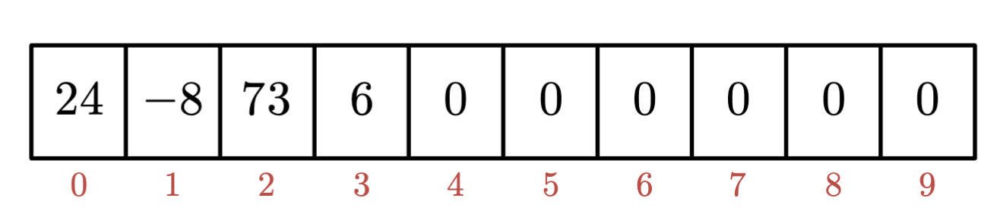
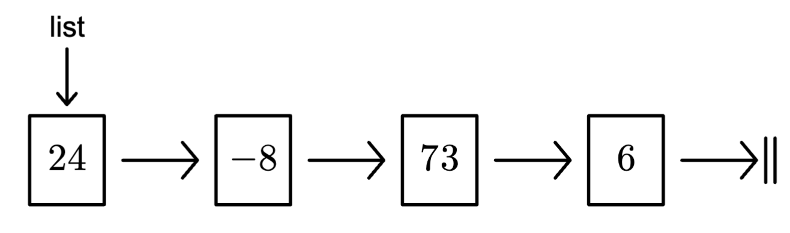

# <code>DSp1Lists</code>
## Array and Linked List Implementation Project

For this assignment you will implement a list of integers.

As our first data structure (with arrays counting as our zero-th
data structure), we will implement a (simplified) list interface.
We will use both an array implementation, and also a node-based
linked list implementation.

For the implementation with arrays, which you will build in the
`MyArrayList` class, you have some choices to make, but the standard
approach is to keep the data together at the beginning of the array.

This makes the `add` and `remove` methods "costly" at times,
while `get` and `set` are "cheap". You will likely also want to
add an instance field to keep track of the size of your list,
since it will typically not be the same as the length of the
underlying array (that length is known as the **capacity**).
You could build a new array of the correct size with each `add` and
`remove`, but that approach is too inefficient. An example of the
array implementation is in Sec 6.4 of *Java Software Structures*.

For the implementation of the linked list, which you will build
in the `MyLinkedList` class, you can either add a new node class
in a separate file, or you can use the `Node` inner class provided.
Be aware of the standard encapsulation requirements, specifically,
 - if you build a separate class, the instance fields should be
private, which means you will need to include (and use) getters
and setters to access them;
 - notice that in the given inner class, the fields are public,
so they can be accessed directly in the rest of the `MyLinkedList` class,
but encapsulation is preserved because the inner class private.

If you decide to remove the inner class provided and write a separate
top-level class, please stick with the *singly-linked* list design.

With the linked list, `add` and `remove` methods are generally
cheaper, because we just do some plumbing and we do not have to
move a bunch of other elements every time. But `get` and `set`
are more work than with the array list, especially if we are
close to the end of the list.

Arrays can certainly hold primitive types, and the nodes we will
build can hold primitives, but the Java List interface has a
type parameter. In that spirit, our lists will hold values of 
type big-I `Integer` instead of little-i `int`. With Java 
*autoboxing*, you will likely not notice the difference.

A skeleton is provided for you, and you will need to adhere
to the public interface given there. In particular, note
that an array of `int`s initializes every entry to zero,
and that is a possible value in the list. You can find the
skeleton classes in the `java` folder, which is inside the
`main` module, under the `src` folder.

You will also see the `test` module under `src`, and within
that are two tester files. We use JUnit 5 for our unit tests,
and they should work properly in IntelliJ (VS Code and Eclipse
users may need to do some fiddling). You **must** be able to
run these test files, and you will need to pass all of them
for full credit on this project.

The two classes you need to modify have been labeled with TODO
in the places where you need to make changes (and IntelliJ will
help you find the TODOs by clicking the three dots under Project |
Commit | Structure on the left margin). You may want to start by
implementing the simple methods `size`, `clear`, and `isEmpty`,
then `addLast` / `addFirst`, `get`, and `set`. After those are
working, you can tackle the more challenging `add`, `remove`,
`indexOf` and `contains` methods.

Most important advice: Start early and change incrementally.
